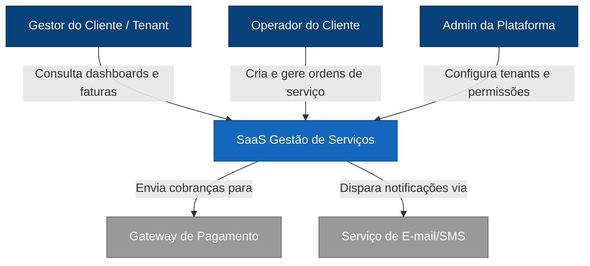

# Diagrama de Contexto (C1)



# Diagrama de Contexto (C2)

```mermaid
graph TB
    %% Definição de Cores (Estilos)
    classDef person fill:#08427b,stroke:#052e56,color:#ffffff
    classDef internal fill:#1168bd,stroke:#0b4c8a,color:#ffffff
    classDef external fill:#999999,stroke:#666666,color:#ffffff

    %% Atores e Externos
    Gestor[Gestor do Cliente]:::person
    Gateway[Gateway de Pagamento]:::external
    Email[Serviço de E-mail/SMS]:::external

    subgraph SaaS_System [SaaS Gestão de Serviços]
        WebApp[Web App - React/Vue]:::internal
        API[API Backend - Node/Java/C#]:::internal
        DB[(Database - SQL)]:::internal
        Queue[Message Queue]:::internal
        Worker[Background Worker]:::internal
    end

    %% Relações
    Gestor -- "Usa" --> WebApp
    WebApp -- "Chamadas HTTPS" --> API
    API -- "Persiste dados" --> DB
    API -- "Enfileira tarefas" --> Queue
    Worker -- "Processa" --> Queue
    Worker -- "Efetua cobrança" --> Gateway
    Worker -- "Notifica" --> Email

    %% Decisões Arquiteturais (Bônus para o relatório)
    note1[Decisão: Pagamentos Assíncronos via Queue]
    note2[Decisão: Database Isolado por Tenant]
    ```
