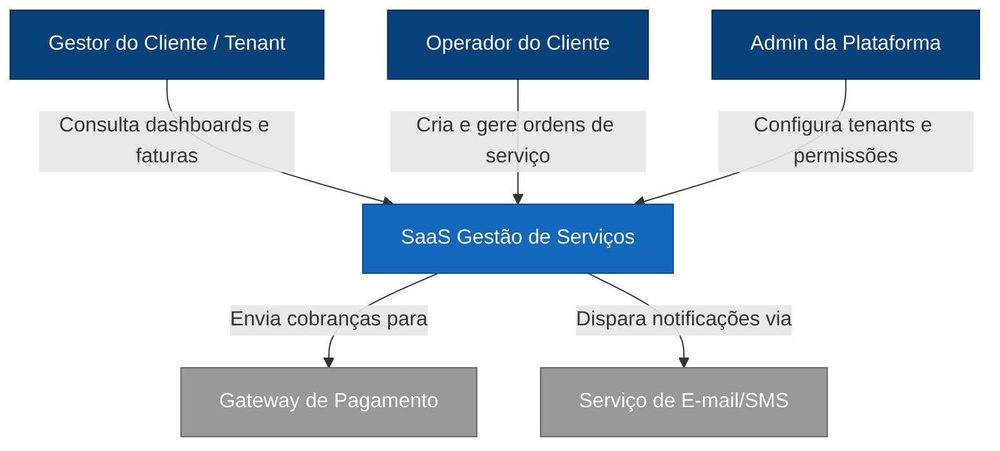

# Diagrama de Contexto (C1)



# Containers (C2)

```mermaid
graph TB
    %% Definição de Cores
    classDef person fill:#08427b,stroke:#052e56,color:#ffffff
    classDef internal fill:#1168bd,stroke:#0b4c8a,color:#ffffff
    classDef external fill:#999999,stroke:#666666,color:#ffffff

    %% Atores e Externos
    Gestor[Gestor do Cliente]:::person
    Gateway[Gateway de Pagamento]:::external
    Email[Serviço de E-mail/SMS]:::external

    subgraph SaaS_System [SaaS Gestão de Serviços]
        WebApp[Web App - React/Vue]:::internal
        API[API Backend - CLIQUE PARA ZOOM]:::internal
        DB[(Database - SQL)]:::internal
        Queue[Message Queue]:::internal
        Worker[Background Worker]:::internal
    end

    %% Relações
    Gestor -- "Usa" --> WebApp
    WebApp -- "Chamadas HTTPS" --> API
    API -- "Persiste dados" --> DB
    API -- "Enfileira tarefas" --> Queue
    Worker -- "Processa" --> Queue
    Worker -- "Efetua cobrança" --> Gateway
    Worker -- "Notifica" --> Email

    %% Decisões Arquiteturais
    note1[Decisão: Pagamentos Assíncronos via Queue]
    note2[Decisão: Database Isolado por Tenant]

   ```

# Components (C3)

```mermaid
graph TB
    %% Definição de Estilos
    classDef person fill:#08427b,stroke:#052e56,color:#ffffff
    classDef internal fill:#1168bd,stroke:#0b4c8a,color:#ffffff
    classDef component fill:#63b3ed,stroke:#2b6cb0,color:#ffffff
    classDef external fill:#999999,stroke:#666666,color:#ffffff

    %% Elementos Externos
    WebApp[Web App]:::internal
    DB[(Database)]:::internal
    Queue[Message Queue]:::internal

    subgraph API_Backend [Container: API Backend]
        IAM[IAM / Auth Component]:::component
        Orders[Service Orders Component]:::component
        Billing[Billing Component - CLIQUE PARA ZOOM]:::component
        Notify[Notifications Orchestrator]:::component
        Reports[Reporting / Audit API]:::component
    end

    %% Relações
    WebApp -- "Solicita acesso/permissão" --> IAM
    WebApp -- "Gerencia OS" --> Orders
    WebApp -- "Consulta faturas" --> Billing
    
    Orders -- "Lê/Grava dados" --> DB
    Billing -- "Grava cobrança" --> DB
    Billing -- "Publica evento de pagamento" --> Queue
    
    Notify -- "Publica comandos de envio" --> Queue
    Reports -- "Consulta base e logs" --> DB

```
# Code (C4)

```mermaid
graph TD
    %% Estilos Sênior
    classDef controller fill:#f6ad55,stroke:#dd6b20,color:#ffffff
    classDef service fill:#63b3ed,stroke:#2b6cb0,color:#ffffff
    classDef pattern fill:#48bb78,stroke:#2f855a,color:#ffffff
    classDef repo fill:#ed64a1,stroke:#b83280,color:#ffffff

    subgraph Billing_Component [C4: Billing Internal Logic]
        BC[Billing Controller]:::controller
        BS[Billing Service]:::service
        
        subgraph Strategy_Pattern [Payment Strategies]
            CC[CreditCardStrategy]:::pattern
            Pix[PixStrategy]:::pattern
            Boleto[BoletoStrategy]:::pattern
        end
        
        BR[Billing Repository]:::repo
    end

    %% Fluxo de Código
    BC -- "1. Recebe requisição" --> BS
    BS -- "2. Valida regras de negócio" --> BS
    BS -- "3. Seleciona estratégia" --> Strategy_Pattern
    Strategy_Pattern -- "4. Persiste intenção" --> BR
    BS -- "5. Notifica sucesso/erro" --> BC
